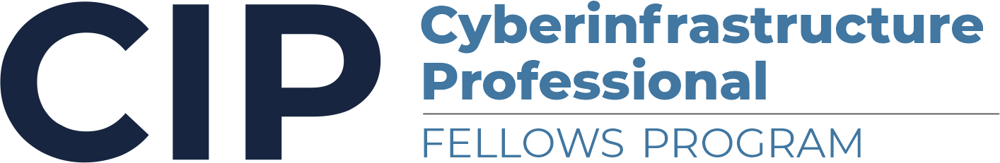

# Program Overview

A critical role within scientific research teams is the cyberinfrastructure (CI) professional who has interdisciplinary skills that bridge the science, engineering, and computing specialties. Readily finding such personnel, with the necessary experience needed to navigate CI ecosytems has become a bottleneck for many projects. The Cyberinfrastructure Professional (CIP) Fellows Program is designed to address this need by training and mentoring a team of interdisciplinary Researcher-Facing (CARCC) CI Professionals with individualized training program in advanced computing and workforce development topics, embedding them into institutional departments, teaching them how to support and facilitate research projects, fostering a long-term CIP community, and defining sustainable career paths specifically for these kinds of professionals.

Cyberinfrastructure — the hardware, software, networks, data and people that underpin today's advanced information technology — offers unprecedented opportunities for economic growth and powers scientific discoveries every day.   

Eligible candidates include those who have domain science and/or computing backgrounds and want to advance their skills in CI, HPC, data science, and have an interest in facilitating scientific research teams who need to use CI resources and services. Potential candidates include: CI research support staff, software engineers, and system administrators,  data curators, computational research scientists and engineers, and CI facilitators (people who work directly with researchers to help them to make effective use of Cyberinfrastructure (CI). The creation of these new CIP-Fellow positions supports the goal of creating long-term career development paths and opening doors to new opportunities for CI Professionals. 

**The CIP-Fellows program is seeking candidates who have the appropriate science and/or computing background and the motivation to work with research teams.**

<!-- 

 -->

## How It Works

Our training approach demonstrates a pedagogical method that is part and parcel of how to develop this unique type of CIP workforce. Namely, it is the combination of individual training, being embedded into projects, coupled with ongoing mentoring, that will most effectively develop personnel with the array of needed skills. Once a Fellow is selected, we will design a customized training program with the goal that they can acquire the combination of technical competencies and soft skills needed to work independently with research teams and to facilitate team research. Training topics can include parallel programming concepts, HPC skills, data management, data sciences skills, AI/ML skills, scientific domain applications and libraries, working on different HPC architectures, and workforce development skills.  A core activity will include giving the CIP-Fellows the opportunity to work on science research efforts identified by the NSF [ACCESS MATCH](https://support.access-ci.org/match/overview) program. 

The outcome of this program can be considered to be analogous to many professional degree programs that have to combine concepts and practice. In some cases, training will result in certificates or badges (depending on the program). In other cases, CIP-Fellows will be encouraged to develop and present training material.

This program is a 3-campus partnership lead by the San Diego Supercomputer Center (SDSC) between UC San Diego, San Diego State University, and Cal State University, San Bernardino. Our flexible, customized training program allows us to support CIP-Fellow trainees for over 12-18 months before transitioning into long-term positions at their home institutions. Potential candidates will work with their local CIP-Fellows site leads to determine eligibility and funding.  Based on available funding, each institution will host multiple positions locally at typically 25-50%. Candidates will receive funding while working through the CIP program. CIP-Fellows will work in established departments at their home institutions, where they will be able to apply their new knowledge to real world situations. When applying, the application will ask for a letter of support and applicant resume. 

Enrollment open:
Winter: January 2024
Fall: September 2024

[To Learn More](https://na.eventscloud.com/ereg/inactive.php?eventid=755152)

Please submit an inquiry to connect with a site lead to learn more about the program.  

*The interdisciplinary training program is supported by NSF, award number 2230127.*

<!-- The ruby gem is available on the Ruby Gems website at the following location. [https://rubygems.org/gems/bulma-clean-theme](https://rubygems.org/gems/bulma-clean-theme). -->

<!-- ## Documentation

For full instructions, please see the [Documentation](/bulma-clean-theme/docs/)

## Page Layouts

This demo site showcases the available page layout options. 

* Sidebar
* Menubar
* Tabs
* Footer
* Hero
* Contents
* Landing Page With Callouts
* Promo Page
* Sponsors Page
* Image Gallery
* Recipe Page
* Blog
* Post

## Supported By JetBrains

JetBrains have kindly provided an Open Source licence to aid in the future development of Bulma Clean Theme.

 -->
